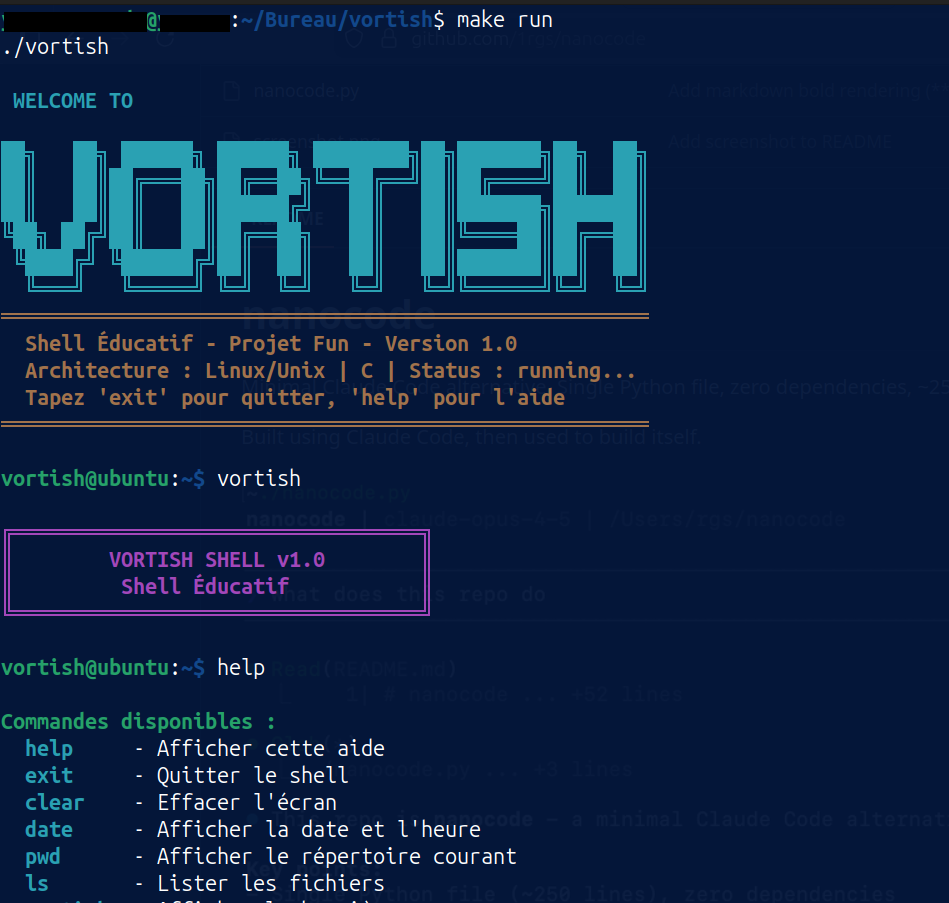
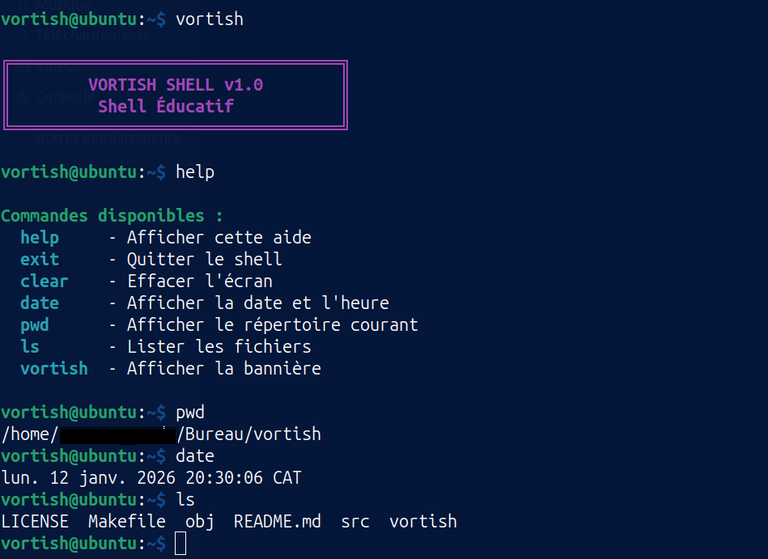

```
    ██╗   ██╗ ██████╗ ██████╗ ████████╗██╗███████╗██╗  ██╗
    ██║   ██║██╔═══██╗██╔══██╗╚══██╔══╝██║██╔════╝██║  ██║
    ██║   ██║██║   ██║██████╔╝   ██║   ██║███████╗███████║
    ╚██╗ ██╔╝██║   ██║██╔══██╗   ██║   ██║╚════██║██╔══██║
     ╚████╔╝ ╚██████╔╝██║  ██║   ██║   ██║███████║██║  ██║
      ╚═══╝   ╚═════╝ ╚═╝  ╚═╝   ╚═╝   ╚═╝╚══════╝╚═╝  ╚═╝
```


# Vortish Shell 

Vortish : Un Shell Éducatif en C pour Ubuntu.

Vortish est un shell minimaliste développé en C pour les systèmes Ubuntu. Conçu comme outil d'apprentissage, il implémente les fonctionnalités fondamentales d'un interpréteur de commandes tout en servant de support pédagogique pour comprendre les mécanismes des systèmes d'exploitation.

## Fonctionnalités

- **Bannière ASCII colorée** au démarrage
- **Interface colorée** avec prompt personnalisé
- **Commandes internes** : help, exit, clear, vortish
- **Exécution des commandes système** (ls, pwd, etc.)
- **Gestion des erreurs** basique

## Architecture du projet
```
vortish/
├── Makefile                    # Script de compilation
├── src/                        # Code source
│   ├── main.c                 # Point d'entrée principal
│   ├── banner.c               # Gestion de la bannière ASCII
│   ├── banner.h               # Header pour la bannière
│   ├── shell.c                # Logique principale du shell
│   └── shell.h                # Header pour le shell
└── README.md                  # Documentation du projet
```
## Architecture technique
```
┌─────────────────────────────────────────────┐
│      Espace Utilisateur (User Space)       │
├─────────────────────────────────────────────┤
│  ┌──────────────┐  ┌────────────────────┐  │
│  │   Vortish    │  │    Bibliothèques   │  │
│  │    Shell     │  │     (libc, etc.)   │  │
│  └──────┬───────┘  └──────────┬─────────┘  │
├─────────┼──────────────────────┼────────────┤
│         │    Appels Système    │            │
│         └──────────┬───────────┘            │
├────────────────────┼─────────────────────────┤
│      Noyau (Kernel Space)                    │
│  ┌──────────────┐  ┌────────────────────┐   │
│  │ Gestion      │  │  Système de        │   │
│  │ Processus    │  │  Fichiers          │   │
│  └──────────────┘  └────────────────────┘   │
└─────────────────────────────────────────────┘
```
## Compilation

```bash
# Compiler le projet
make

# Compiler et exécuter
make run

# Nettoyer les fichiers objets
make clean

# Utilisation
./vortish

# Commandes disponibles
- help
- exit
- clear
- vortish
- Toutes les commandes systemes standards : ls, pwd, date, etc.

```
## Aperçu






## Références & Ressources

Ces livres et ressources ont inspiré et soutenu le développement de **Vortish** :

- **[The C Programming Language](https://fr.wikipedia.org/wiki/The_C_Programming_Language)**  
  *Brian W. Kernighan & Dennis M. Ritchie*

- **[Advanced Programming in the UNIX Environment](https://www.apuebook.com/)**  
  *W. Richard Stevens*

- **[Operating Systems: Three Easy Pieces](https://pages.cs.wisc.edu/~remzi/OSTEP/)**  
  *Remzi & Andrea Arpaci-Dusseau*

- **[Linux Kernel Development](https://www.oreilly.com/library/view/linux-kernel-development/9780672329463/)**  
  *Robert Love*

- **[The Linux Programming Interface](http://man7.org/tlpi/)**  
  *Michael Kerrisk*
