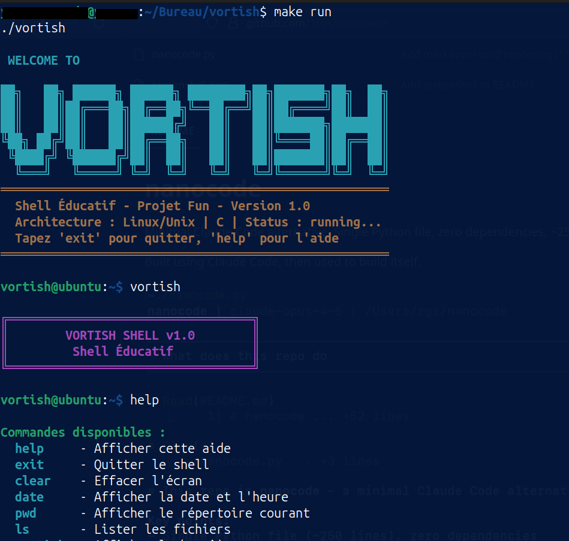
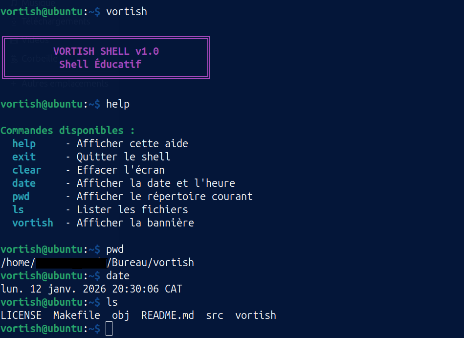

```
    ██╗   ██╗ ██████╗ ██████╗ ████████╗██╗███████╗██╗  ██╗
    ██║   ██║██╔═══██╗██╔══██╗╚══██╔══╝██║██╔════╝██║  ██║
    ██║   ██║██║   ██║██████╔╝   ██║   ██║███████╗███████║
    ╚██╗ ██╔╝██║   ██║██╔══██╗   ██║   ██║╚════██║██╔══██║
     ╚████╔╝ ╚██████╔╝██║  ██║   ██║   ██║███████║██║  ██║
      ╚═══╝   ╚═════╝ ╚═╝  ╚═╝   ╚═╝   ╚═╝╚══════╝╚═╝  ╚═╝
```


# Vortish Shell 

Vortish : Un Shell Éducatif en C pour Ubuntu.

Vortish est un shell minimaliste développé en C pour les systèmes Ubuntu. Conçu comme outil d'apprentissage, il implémente les fonctionnalités fondamentales d'un interpréteur de commandes tout en servant de support pédagogique pour comprendre les mécanismes des systèmes d'exploitation.

## Fonctionnalités

- **Bannière ASCII colorée** au démarrage
- **Interface colorée** avec prompt personnalisé
- **Commandes internes** : help, exit, clear, vortish
- **Exécution des commandes système** (ls, pwd, etc.)
- **Gestion des erreurs** basique
- **Historique des commandes** avec persistance et rappel (!n, !!, history)
- **Support des pipes (|)** pour chainer plusieurs commandes

## Architecture du projet
```
vortish/
├── Makefile                    # Script de compilation
├── src/                        # Code source
│   ├── main.c                 # Point d'entrée principal
│   ├── banner.c               # Gestion de la bannière ASCII
│   ├── banner.h               # Header pour la bannière
│   ├── shell.c                # Logique principale du shell
│   └── shell.h                # Header pour le shell
└── README.md                  # Documentation du projet
└── .vortish_history           # Fichier d'historique (créé à l'exécution)
```
## Architecture technique
```
┌─────────────────────────────────────────────┐
│      Espace Utilisateur (User Space)        │
├─────────────────────────────────────────────┤
│  ┌──────────────┐  ┌────────────────────┐   │
│  │   Vortish    │  │    Bibliothèques   │   │
│  │    Shell     │  │     (libc, etc.)   │   │
│  └──────┬───────┘  └──────────┬─────────┘   │
├─────────┼──────────────────────┼────────────┤
│         │    Appels Système    │            │
│         └──────────┬───────────┘            │
├────────────────────┼────────────────────────┤
│      Noyau (Kernel Space)                   │
│  ┌──────────────┐  ┌────────────────────┐   │
│  │ Gestion      │  │  Système de        │   │
│  │ Processus    │  │  Fichiers          │   │
│  └──────────────┘  └────────────────────┘   │
│  ┌──────────────────────────────────────┐   │
│  │    Communication Inter-Processus     │   │
│  │         (Pipes, signaux, etc.)       │   │
│  └──────────────────────────────────────┘   │
└─────────────────────────────────────────────┘
```

## Gestion de l'Historique

Vortish intègre un système d'historique persistant qui enregistre toutes les commandes tapées par l'utilisateur.

### Commandes liées à l'historique

| Commande | Description                                                      |
|----------|------------------------------------------------------------------|
| `history`| Affiche la liste des commandes précédentes avec leurs numéros    |
| `!!`     | Exécute la dernière commande                                     |
| `!n`     | Exécute la commande numéro `n` (ex: `!5` exécute la 5e commande) |

### Persistance

- L'historique est automatiquement **chargé** au démarrage depuis le fichier `.vortish_history`
- Il est **sauvegardé** à la sortie du shell (commande `exit`)
- Le fichier d'historique est **effacé** avec `make clean`

### Implémentation technique

- Stockage en mémoire via un **tableau circulaire** de 100 entrées maximum
- Allocation dynamique avec `malloc()` pour chaque commande
- Évite les doublons consécutifs
- Ignore les commandes d'historique elles-mêmes (`history`, `!n`, `!!`) pour ne pas polluer

### Support des pipes (|)

Vortish supporte désormais les pipes, permettant de chaîner plusieurs commandes et de créer des pipelines de traitement.

Exemples d'utilisation
```bash
# Compter le nombre de fichiers dans le répertoire courant
ls -la | wc -l

# Rechercher un processus spécifique
ps aux | grep bash

# Compter les fichiers C dans un projet
ls -la | grep ".c" | wc -l

# Afficher les 5 derniers fichiers modifiés
ls -lt | head -5
```
Étape de fonctionnement + (Description)

1. Parsing	(La commande est découpée au niveau   des symboles |)
2. Création des pipes	(Un pipe est créé entre chaque commande consécutive)
3. Forks	(Un processus enfant est créé pour chaque commande)
4. Redirections	(Les sorties/entrées sont redirigées vers les pipes avec dup2())
5. Exécution	(Chaque enfant exécute sa commande avec execvp())
6. Synchronisation	(Le parent attend la fin de tous les enfants)

#### Limitations actuelles
- Maximum de 10 commandes chaînées (configurable)
- Les commandes internes (cd, exit, etc.) ne fonctionnent pas dans les pipes
- Pas de gestion des erreurs avancée (pipe cassé, etc.)

## Compilation

```bash
# Compiler le projet
make

# Compiler et exécuter
make run

# Nettoyer les fichiers objets et le fichier d'historique
make clean

# Utilisation
./vortish
```

## Commandes disponibles

| Commande               | Description                                          |
|------------------------|------------------------------------------------------|
| `help`                 | Affiche l'aide                                       |
| `exit`                 | Quitte le shell                                      |
| `clear`                | Efface l'écran                                       |
| `vortish`              | Affiche le logo                                      |
| `history`              | Affiche l'historique des commandes                   |
| `!!`                   | Exécute la dernière commande                         |
| `!n`                   | Exécute la commande numéro n                         |
| `ls`, `pwd`, `date`... | Toutes les commandes système standards               |
| `cmd1 \| cmd2`       | Chaîne deux commandes avec un pipe                    |

## Évolution du projet

### Version 1.0 (Fonctionnalités de base)
- Structure du shell
- Commandes internes simples
- Exécution de commandes système

### Version 1.1 (Ajout de l'historique)
- Historique persistant des commandes
- Rappel des commandes avec !n et !!
- Sauvegarde automatique dans fichier
- Chargement automatique au démarrage

### Version 1.2 (Pipes)
- Support des pipes (|) pour chainer les commandes
- Communication inter-processus
- Gestion de multiples processus fils

### Version 1.3 (A venir)
- Redirections (>, <, >>)
- Commandes en arriere-plan (&)
- Gestion des signaux (Ctrl+C)


## Exemples d'utilisation

```bash
# Démarrer Vortish
$ ./vortish

# Taper quelques commandes
vortish@ubuntu:~$ ls -la
vortish@ubuntu:~$ pwd
vortish@ubuntu:~$ date

# Voir l'historique
vortish@ubuntu:~$ history
  1  ls -la
  2  pwd
  3  date

# Utiliser les pipes
vortish@ubuntu:~$ ls -la | grep ".c"
vortish@ubuntu:~$ ps aux | grep bash | wc -l

# Réexécuter une commande
vortish@ubuntu:~$ !1    # Réexécute 'ls -la'

# Quitter
vortish@ubuntu:~$ exit
```

## Aperçu






## Références & Ressources

Ces livres et ressources ont inspiré et soutenu le développement de **Vortish** :

- **[The C Programming Language](https://fr.wikipedia.org/wiki/The_C_Programming_Language)**  
  *Brian W. Kernighan & Dennis M. Ritchie*

- **[Advanced Programming in the UNIX Environment](https://www.apuebook.com/)**  
  *W. Richard Stevens*

- **[Operating Systems: Three Easy Pieces](https://pages.cs.wisc.edu/~remzi/OSTEP/)**  
  *Remzi & Andrea Arpaci-Dusseau*

- **[Linux Kernel Development](https://www.oreilly.com/library/view/linux-kernel-development/9780672329463/)**  
  *Robert Love*

- **[The Linux Programming Interface](http://man7.org/tlpi/)**  
  *Michael Kerrisk*
